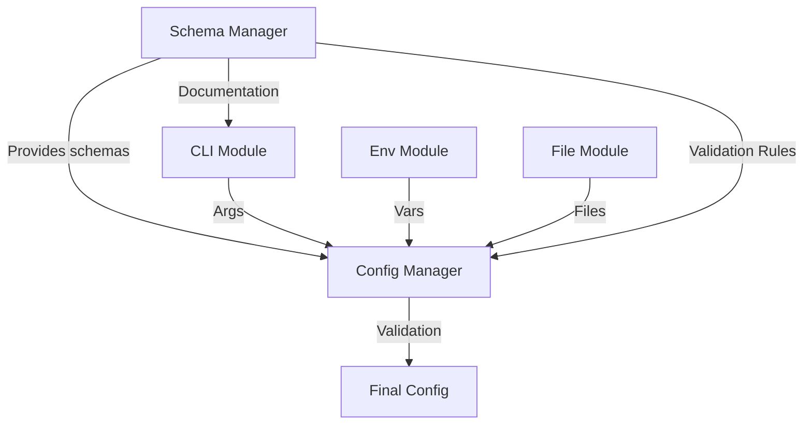

Here's a unified design combining both proposals with schema-driven documentation and priority management:

---

# Unified Configuration Loader System Design

## Core Architecture



---

## 1. Configuration Schema Manager

**File:** `schemas/config-schema.ts`  
**Responsibility:** Central schema registry with documentation support

```ts
export const ConfigSchema = {
  // Core settings with descriptions
  core: z
    .object({
      port: z.number().default(3000).describe("Main application port"),
      env: z.enum(["dev", "staging", "prod"]).describe("Runtime environment"),
    })
    .describe("Core application configuration"),

  // Database configuration
  db: z
    .object({
      host: z.string().describe("Database hostname"),
      port: z.number().positive().describe("Database connection port"),
    })
    .describe("Database settings"),

  // Plugin system
  plugins: z.record(z.unknown()).describe("Plugin configurations"),
};

export type ConfigType = z.infer;
```

---

## 2. Module Specifications

### A. Command-Line Arguments Module

**Components:**

- `cli-parser.ts` (Argument parsing)
- `cli-help.ts` (Documentation generator)

**Features:**

- Auto-generate help using schema descriptions:
  ```bash
  Options:
    --core.port    Main application port (default: 3000)
    --db.host      Database hostname (required)
    --core.env     Runtime environment [dev|staging|prod]
  ```
- Support nested keys (`--db.port=3306`)
- Type conversion (string → number/boolean)

---

### B. Environment Module

**Components:**

- `env-loader.ts` (System environment)
- `dotenv-processor.ts` (.env file loader)

**Features:**

- Load `.env` files with schema-aware parsing
- Automatic nesting conversion:
  ```ini
  DB_HOST=localhost → { db: { host: 'localhost' } }
  ```
- Merge priority: System ENV > .env file

---

### C. Configuration Files Module

**Components:**

- `file-loader.ts` (JSON/YAML/JS configs)
- `plugin-registry.ts` (Plugin config isolation)

**Features:**

- Hierarchical loading:
  1. `config/base.json` (defaults)
  2. `config/production.json` (environment-specific)
  3. `plugins/*.json` (plugin configs)
- Support multiple file formats
- Separate plugin configurations into dedicated namespace

---

### D. Config Manager (Core)

**Components:**

- `priority-merger.ts` (Configuration merging)
- `zod-validator.ts` (Schema validation)

**Merging Precedence:**

1. CLI Arguments
2. Environment Variables
3. Config Files
4. Default Values (from schema)

**Validation Flow:**

```ts
const rawConfig = mergeFromAllSources();
const result = ConfigSchema.safeParse(rawConfig);

if (!result.success) {
  throw new ConfigValidationError(
    result.error,
    ConfigSchema // For error message formatting
  );
}
```

---

## 3. Documentation Integration

**Cross-Module Usage:**

1. CLI Help Generation:
   ```ts
   // cli-help.ts
   generateHelpText(ConfigSchema);
   ```
2. Validation Error Messages:

   ```
   Configuration Error: Invalid value for 'db.port'
   - Expected positive number, got 'mysql'
   - Description: Database connection port
   ```

3. Configuration Templates:
   ```json
   {
     "core": {
       "port": 3000, // Main application port
       "env": "dev" // Runtime environment
     }
   }
   ```

---

## 4. File Structure

```
src/config/
├── schemas/
│   ├── core.schema.ts
│   ├── db.schema.ts
│   ├── plugins.schema.ts
│   └── index.ts
├── loaders/
│   ├── cli/
│   ├── env/
│   ├── files/
│   └── manager/
│       ├── priority-merger.ts
│       └── zod-validator.ts
└── types/
    └── config.ts
```

---

## 5. Implementation Sequence

1. Define core schemas with descriptions
2. Implement configuration merging with precedence
3. Build CLI argument parser with help generator
4. Create environment loader with .env support
5. Develop file loader with plugin isolation
6. Integrate Zod validation with error formatting
7. Add documentation generation hooks

Would you like me to provide a complete TypeScript implementation outline or focus on a specific component's code structure?

---

Answer from Perplexity: pplx.ai/share
